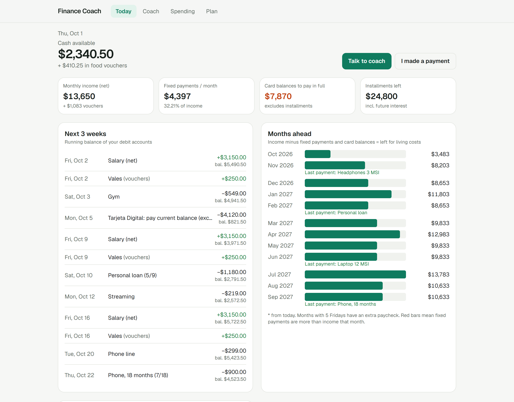
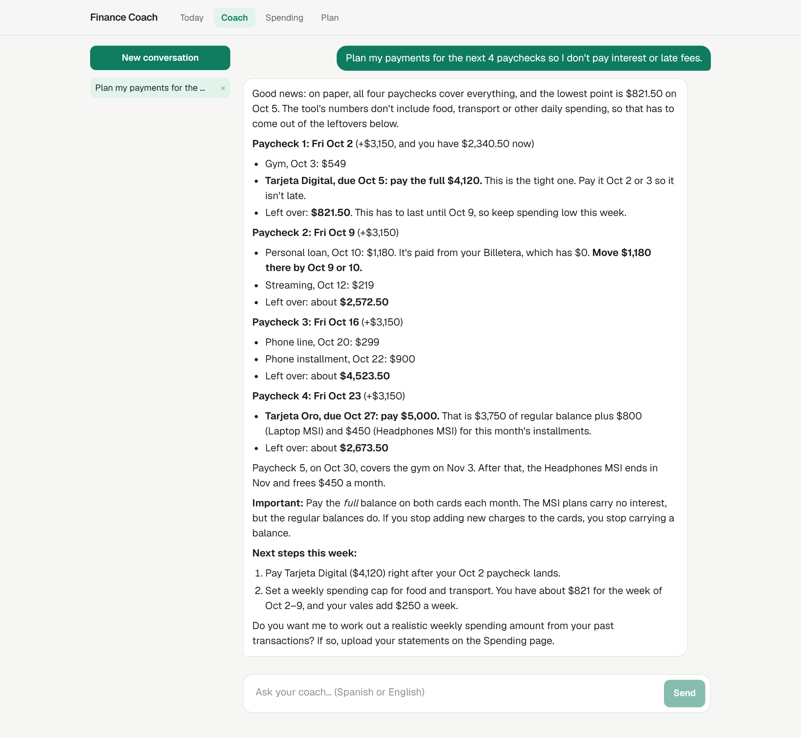
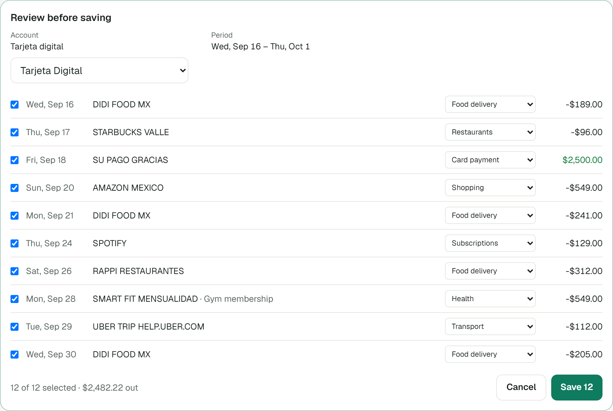
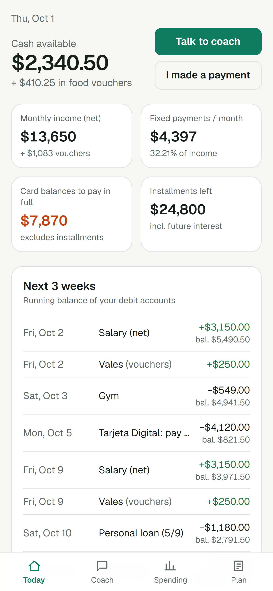
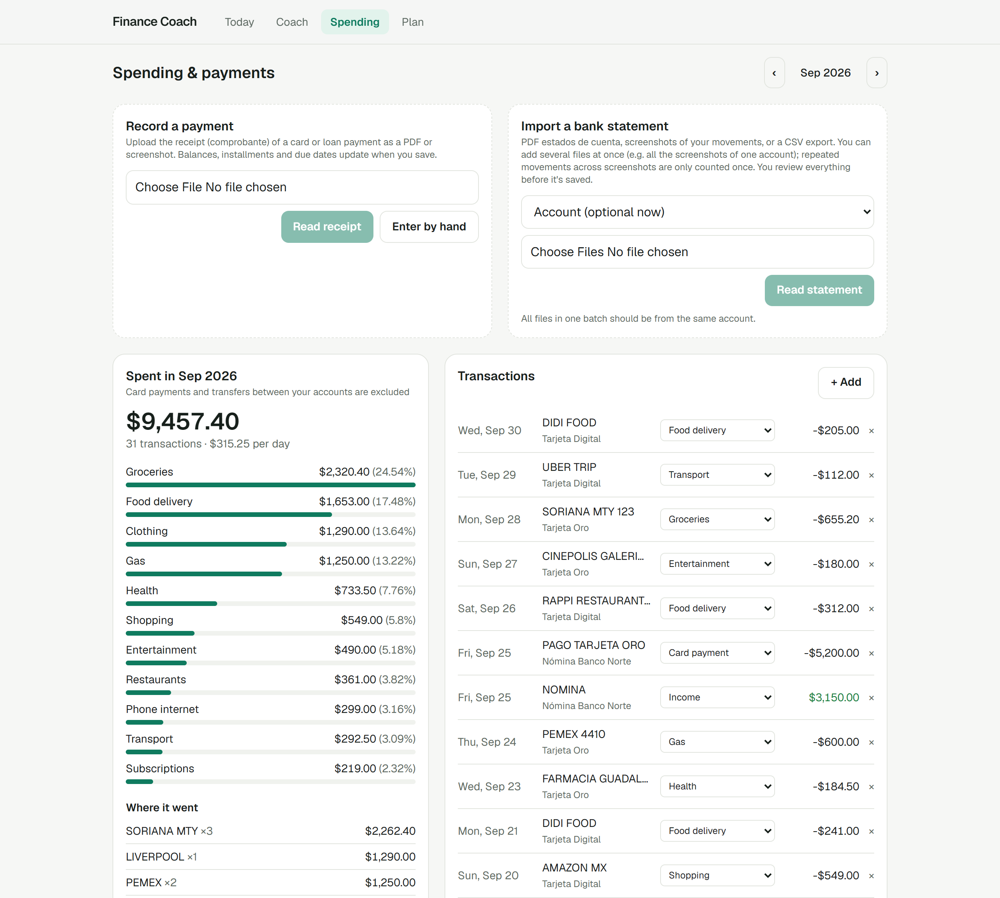

# Finance Coach

A personal finance app with an AI coach. I built it for my own money in Mexico: weekly pay, credit cards with
*meses sin intereses* (MSI) installments, small loans, and the question "can I pay everything on time this month?".



<sub>All screenshots use made-up data.</sub>

## What I built

**A tool-using AI agent.** The coach is Claude, connected through the Anthropic SDK in a streaming agent loop
with 18 tools:
- Reading: accounts, cash flow, monthly projection, spending, transactions, every record on the plan.
- Calculating: arithmetic and payoff plans.
- Changing data: anything you can change in the app, including accounts and cards, installment plans, bills,
  income, goals, transactions, payments, your profile and its memory. Edits go through the same validation as
  the forms.

It looks things up instead of guessing, and it can act: "I paid my card" updates balances and due dates, and "the
gym is charged to my card on the 28th" moves that bill onto the card's statement.
Conversations are stored append-only, and the system prompt is frozen per conversation so prompt caching keeps
working.

**Math done in code, never by the model.** A small engine of pure, tested functions (`src/lib/engine.ts`)
handles everything the coach quotes:
- Each card's *fecha límite de pago*, worked out from its *fecha de corte* (statement day).
- How much of a card balance is MSI, so you know what must be paid in full.
- Installment schedules.
- A running cash balance through every payday and payment.
- When each plan ends, and how much that frees up.

When the coach needs arithmetic, it calls a `calculate` tool.



**Statement and receipt extraction.** Mexican banks rarely export CSV, so the app reads what you have:
- **Formats:** PDF statements, phone screenshots, or CSV.
- **One request per batch:** several screenshots are read together, with structured output validated by a Zod
  schema. Movements that repeat across overlapping screenshots are counted once.
- **Smaller uploads:** images are downscaled in the browser first.
- **Review first:** you check everything before it's saved.
- **Payment receipts** (*comprobantes*) update the card balance, mark the covered installments as paid, and
  move the next due date. A duplicate guard keeps the same receipt from counting twice.



**An installable phone app (PWA).** It's mobile-first, has its own home-screen icon, and works in Safari on
iPhone through "Add to Home Screen". It's protected by a passcode with a lockout after repeated wrong attempts.

<p align="center"></p>



## Stack

Next.js 16 (App Router, Server Actions) · React 19 · TypeScript · Tailwind CSS 4 · Anthropic TypeScript SDK
(Claude Sonnet 5.5 by default) · Zod · libSQL (a local SQLite file, or Turso when hosted) · Vitest.

## Run it

1. Get a Claude API key at [platform.claude.com](https://platform.claude.com).
2. Copy `.env.example` to `.env.local` and set `ANTHROPIC_API_KEY`. Optionally set `APP_PASSCODE` too.
3. Run:

```bash
npm install
npm run dev
```

Then open http://localhost:3000 and add your accounts, cards and installments on the **Plan** page.

**To host it,** deploy to Vercel with a free [Turso](https://turso.tech) database. Set `DATABASE_URL`,
`DATABASE_AUTH_TOKEN` and `APP_PASSCODE` in the project settings. Uploads are limited to about 4.5 MB per
request there, so split large PDFs.

**Privacy:** your data lives only in your database. Optional starting data goes in `data/seed.json`, which is
git-ignored. Text you send to the coach, and the statements you upload, are processed by the Claude API.

## Code map

| Path | What's there |
|---|---|
| `src/lib/engine.ts` | Cash flow, card due dates, installment schedules, projections |
| `src/lib/payments.ts` | What a payment changes (balances, installments, due dates) |
| `src/lib/coach/` | The coach's system prompt and tools |
| `src/app/api/chat` | Streaming agent loop |
| `src/app/api/import`, `src/app/api/receipt` | Statement and receipt extraction |

```bash
npm test    # 31 tests: engine, payments, coach tools, login lockout
```

## License

MIT
